# canarybg 🐤📚🦚
canarybg : Fortune-App # Manage Deployments by Kubernetes Engine # Canary # Blue-Green

## Objective
-  Use kubectl tool
-  Create deployment yaml files
-  Launch, update & scale deployments
-  Update deployments and test Canary & Blue-Green deployment styles

# Managing Deployments Using Kubernetes Engine - Canary & Blue-Green Deployment

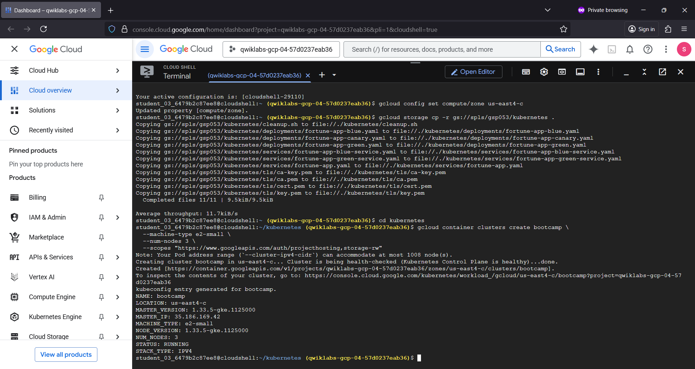

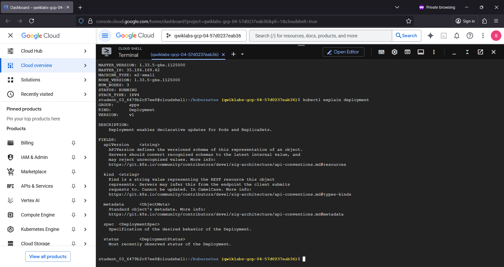

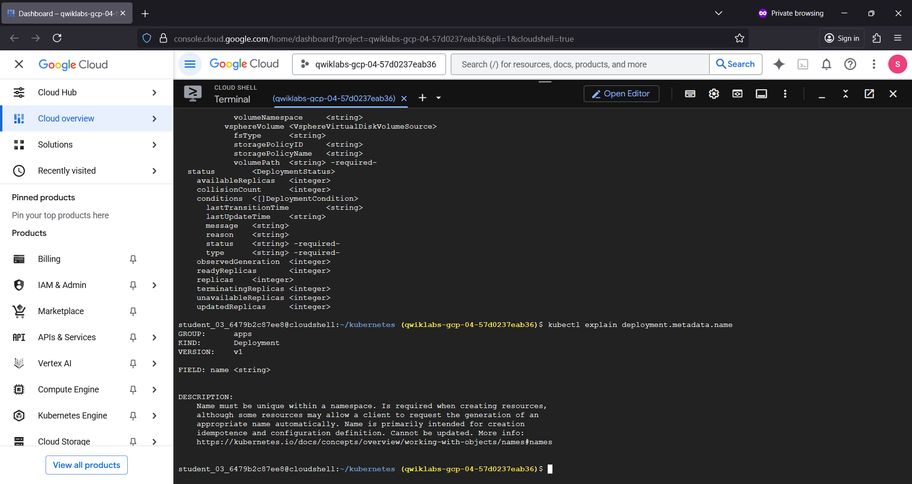

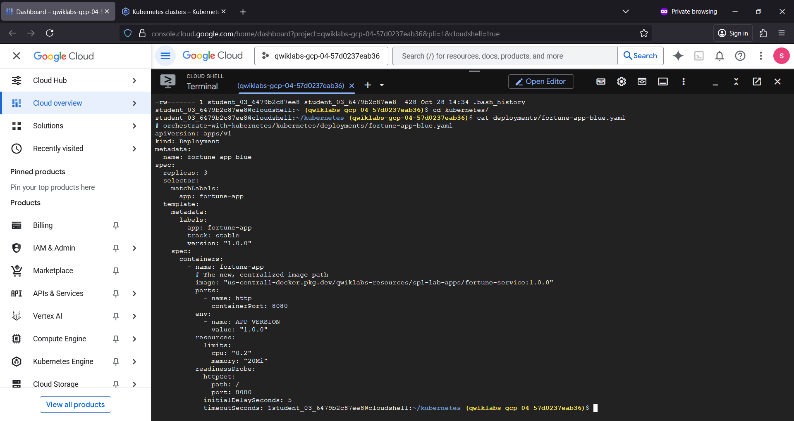

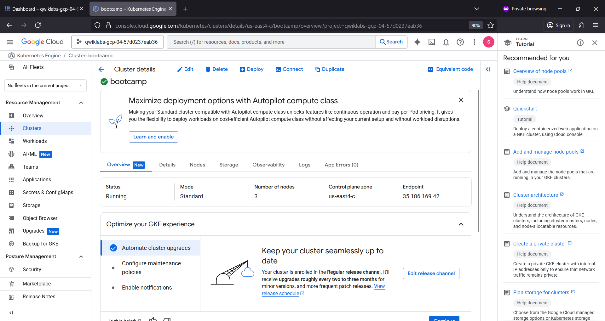

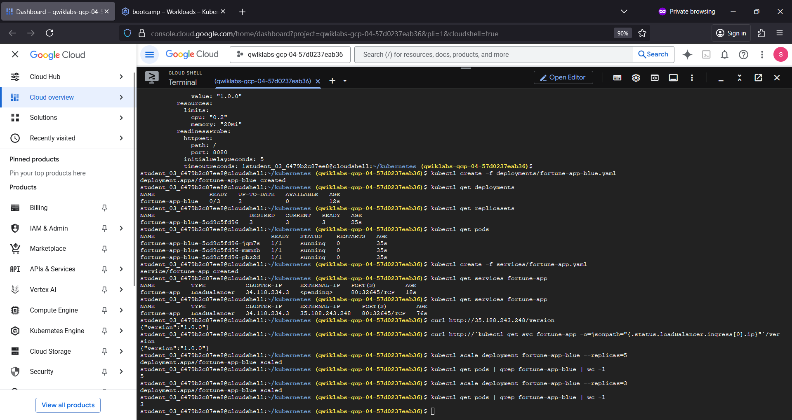

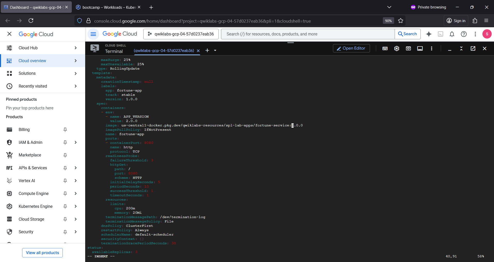

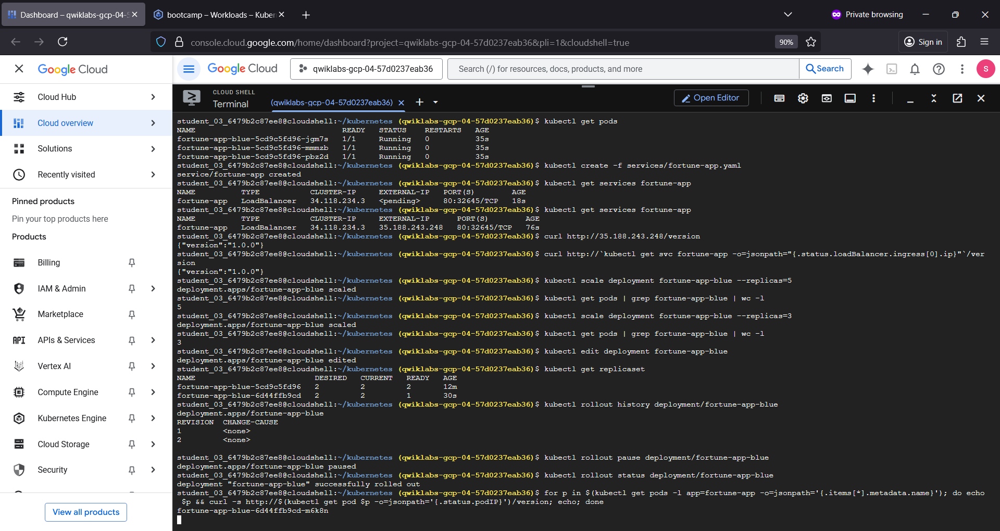

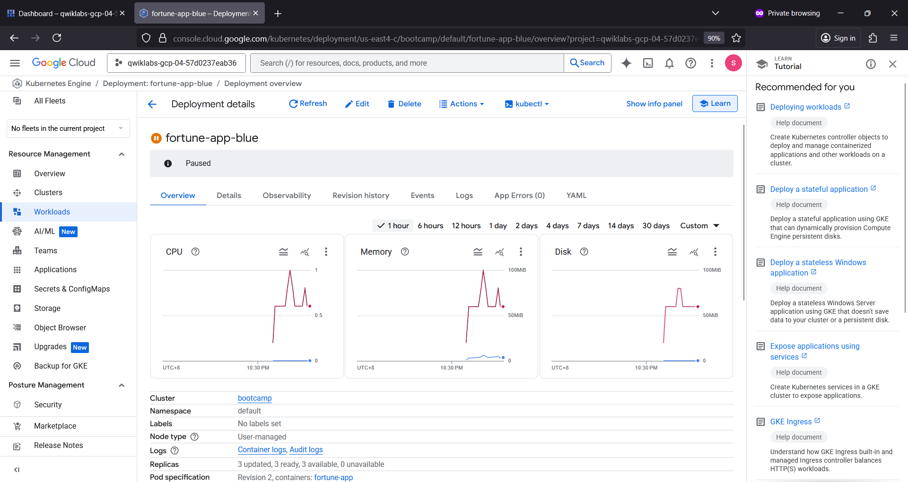

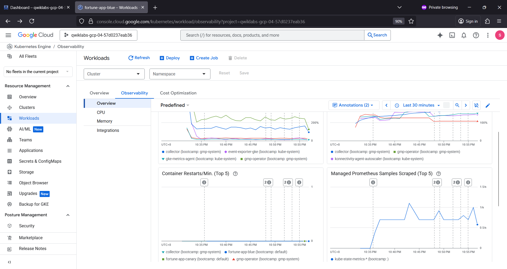

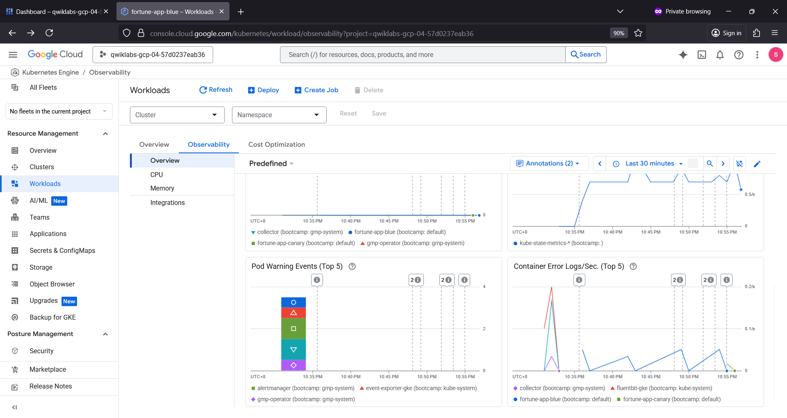

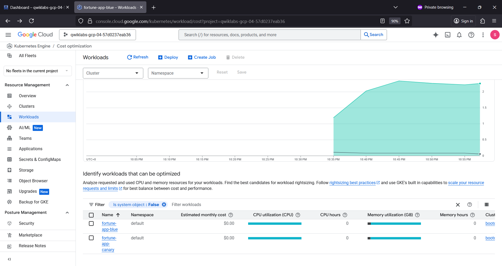

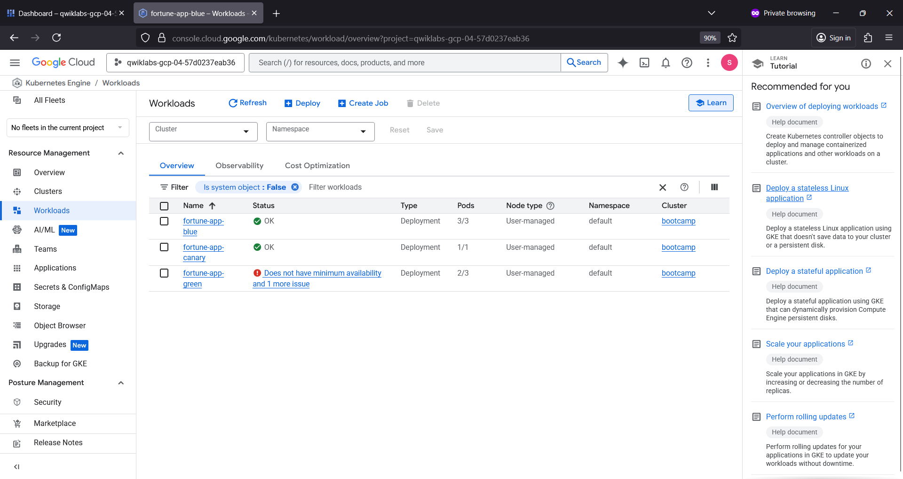

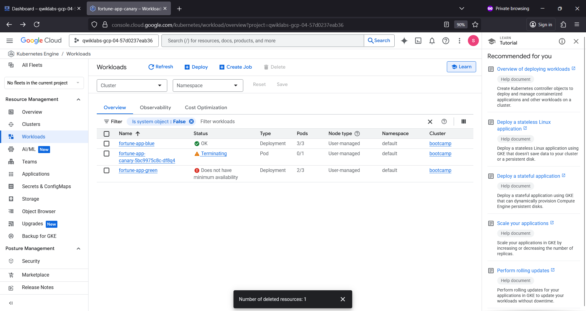

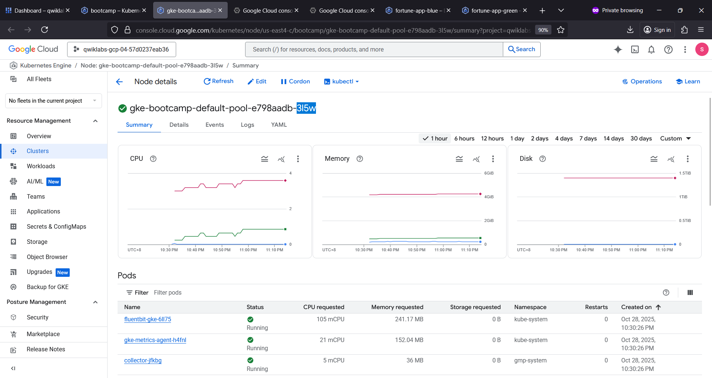

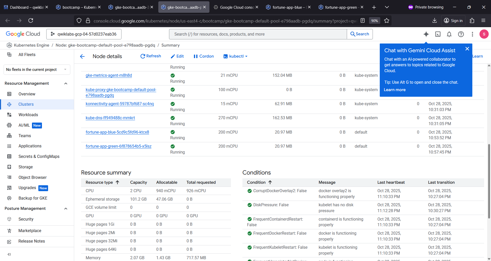

